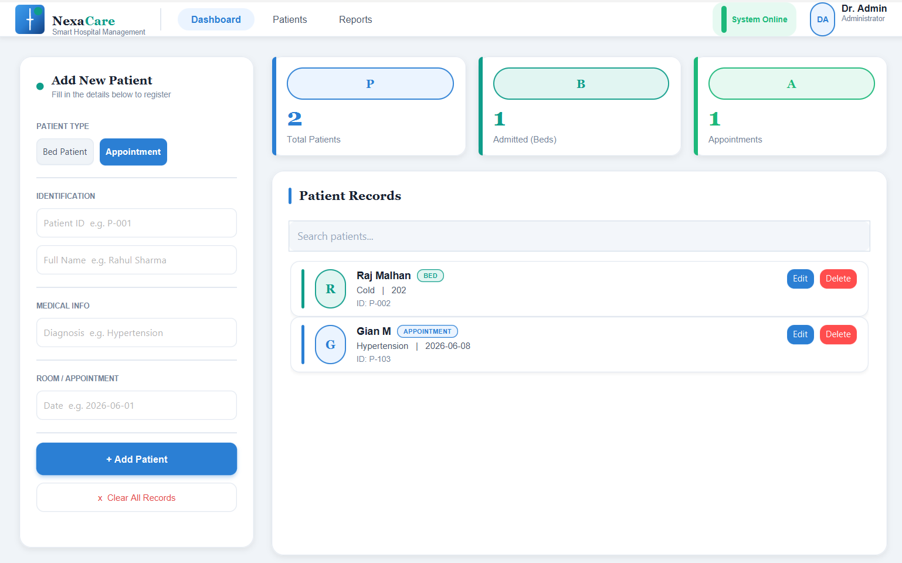
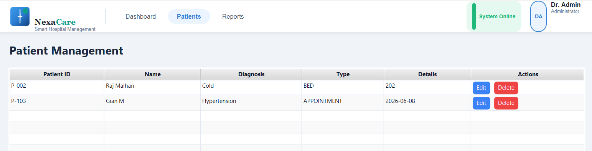

# NexaCare — Hospital Management System


A full-stack Hospital Management System built with **JavaFX**, **Spring Boot**, and **PostgreSQL** — featuring a native desktop interface backed by a cloud-hosted REST API and persistent cloud database.

---

## Overview

NexaCare allows healthcare staff to manage patient records efficiently through a professional desktop interface. The application is fully cloud-connected, with a live backend hosted on Render and data stored in a Neon PostgreSQL instance.

**Live Backend:** `https://hospital-backend1-2dav.onrender.com`

---

## Architecture

**Local Development**
```
JavaFX Desktop App  →  Spring Boot REST API  →  PostgreSQL
```

**Production**
```
JavaFX Desktop App  →  Render (Spring Boot)  →  Neon PostgreSQL (Cloud)
```

---

## Features

**Patient Management**
- Create, read, update, and delete patient records
- Search patients by name or ID
- Real-time sync with cloud database

**Dashboard**
- Total patient count
- Bed allocation tracking
- Appointment overview

**Backend**
- RESTful API with JSON responses
- Spring Data JPA + Hibernate ORM
- Dockerized and deployed on Render

---

## Tech Stack

| Layer | Technology |
|---|---|
| Desktop UI | JavaFX, CSS |
| Backend | Spring Boot, Spring Data JPA, Hibernate |
| Database | PostgreSQL, Neon PostgreSQL |
| Deployment | Docker, Render |
| Build | Maven, Maven Wrapper |
| Language | Java 21 |

---

## Project Structure

```
Hospital-Management-Sys/
├── frontend/
│   ├── src/
│   └── pom.xml
│
├── backend/
│   ├── src/
│   │   ├── controller/
│   │   ├── entity/
│   │   ├── repository/
│   │   ├── service/
│   │   └── config/
│   ├── Dockerfile
│   └── pom.xml
│
└── README.md
```

---

## REST API Reference

| Method | Endpoint | Description |
|---|---|---|
| `GET` | `/patients` | Retrieve all patients |
| `POST` | `/patients` | Add a new patient |
| `PUT` | `/patients/{id}` | Update a patient record |
| `DELETE` | `/patients/{id}` | Remove a patient record |

---

## Local Setup

### Prerequisites
- Java 21+
- Maven
- PostgreSQL (local) or a Neon connection string

### 1. Clone the repository

```bash
git clone https://github.com/Gauravd1710/Hospital-Management-Sys.git
cd Hospital-Management-Sys
```

### 2. Configure the database

In `backend/src/main/resources/application.properties`, set your database URL, username, and password:

```properties
spring.datasource.url=jdbc:postgresql://localhost:5432/nexacare
spring.datasource.username=your_username
spring.datasource.password=your_password
```

### 3. Start the backend

```bash
cd backend
./mvnw spring-boot:run
```

API available at `http://localhost:8080`

### 4. Start the frontend

```bash
cd frontend
./mvnw javafx:run
```

---

## Docker

```bash
# Build the image
docker build -t nexacare-backend ./backend

# Run the container
docker run -p 8080:8080 nexacare-backend
```

---

## Screenshots

> Add screenshots to a `/screenshots` folder and update the paths below.

| Dashboard | Patient Management |
|---|---|
|  |  |

---

## Roadmap

The current monolith is architected for clean extraction into microservices.

- [ ] API Gateway
- [ ] JWT Authentication & Role-Based Access Control
- [ ] Doctor Service
- [ ] Appointment Service
- [ ] Billing Service
- [ ] Docker Compose for local orchestration
- [ ] CI/CD Pipeline (GitHub Actions)
- [ ] Prometheus + Grafana monitoring

---

## Author

**Gaurav Dongre**
[github.com/Gauravd1710](https://github.com/Gauravd1710)

---

*If this project was useful to you, consider giving it a ⭐ on GitHub.*